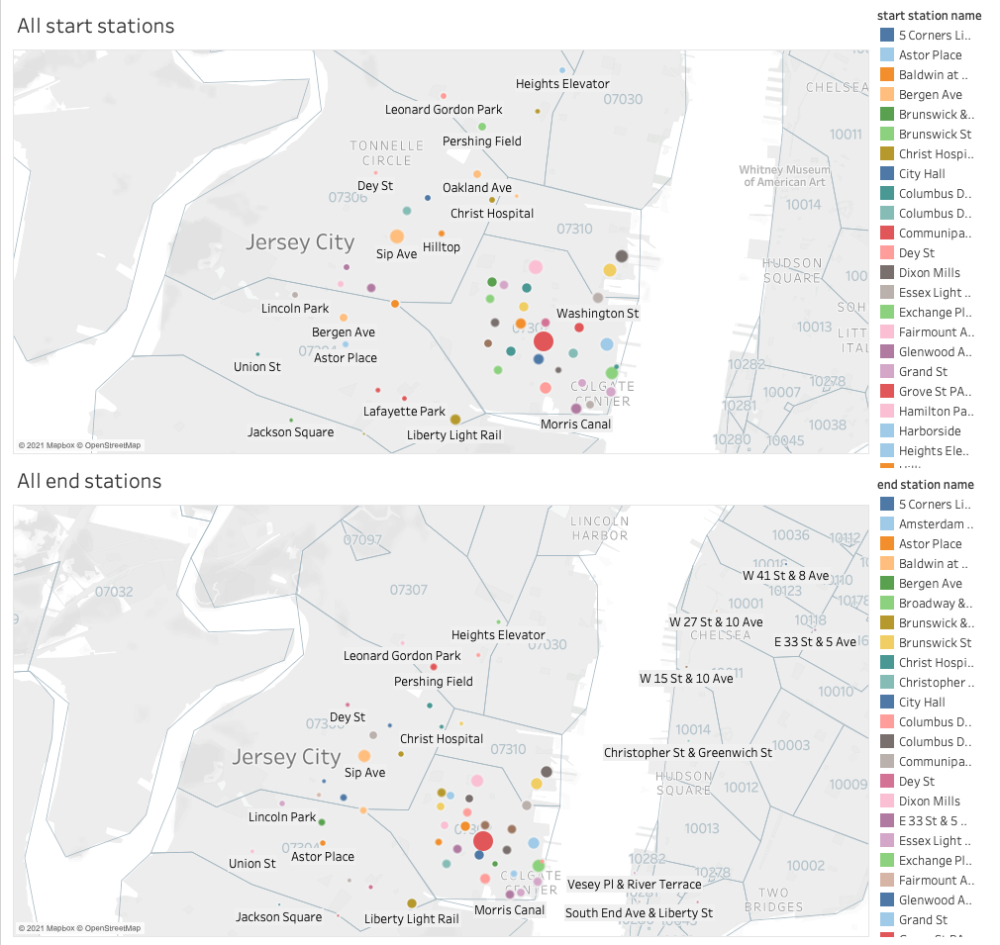
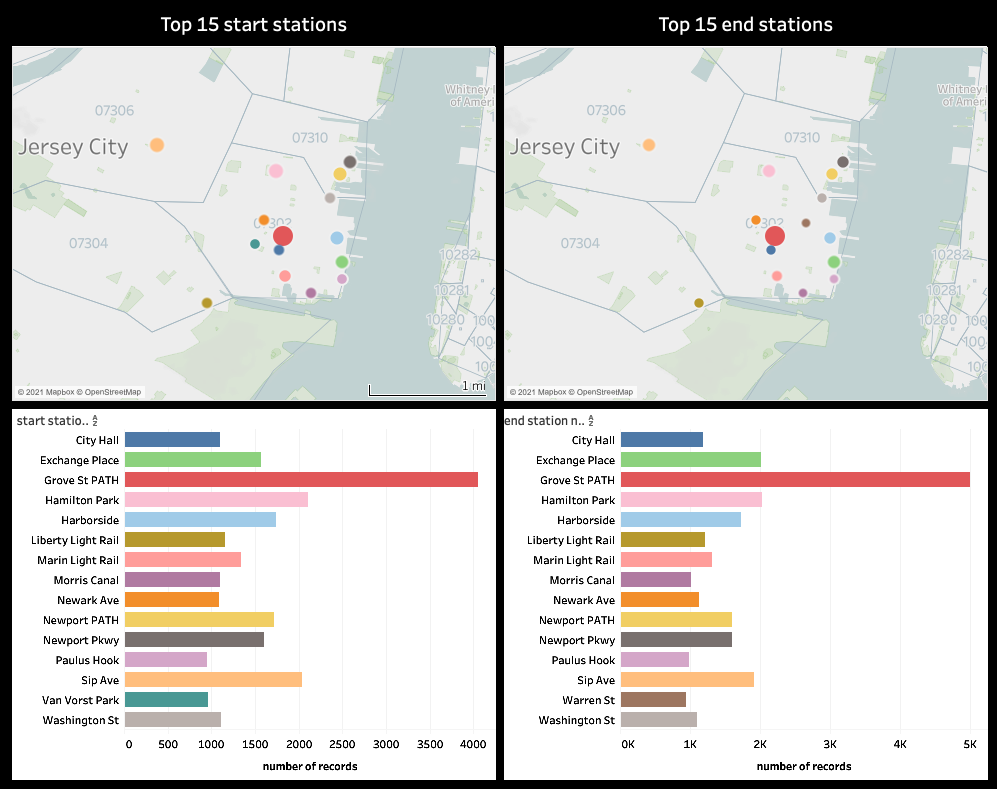
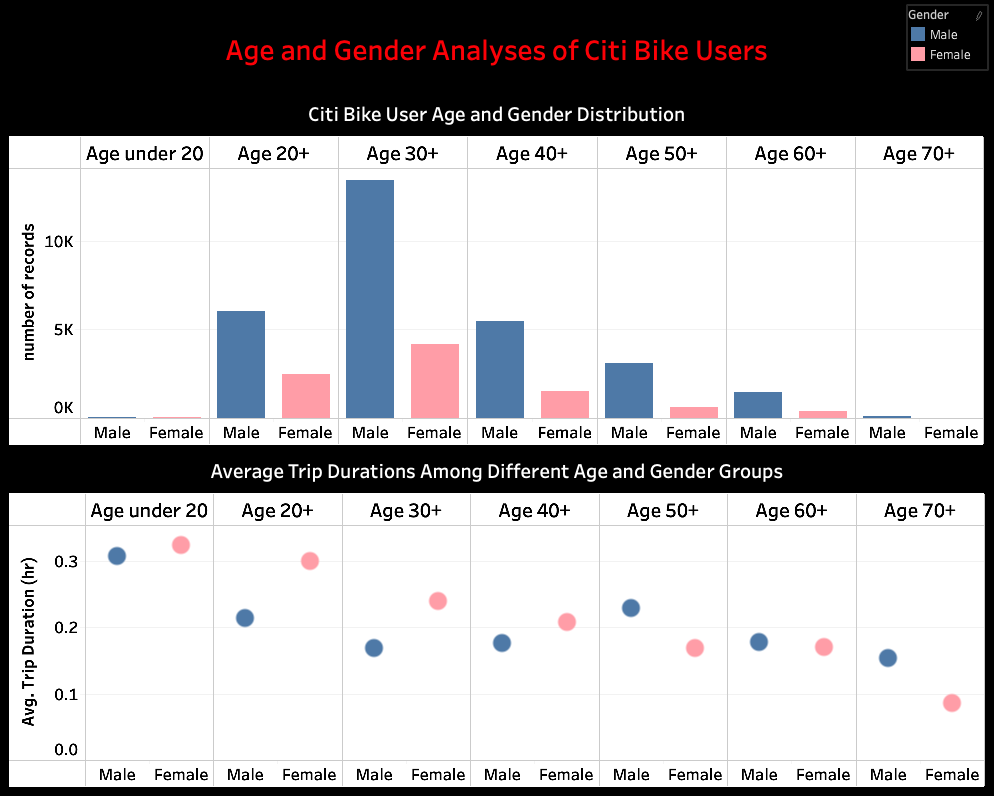
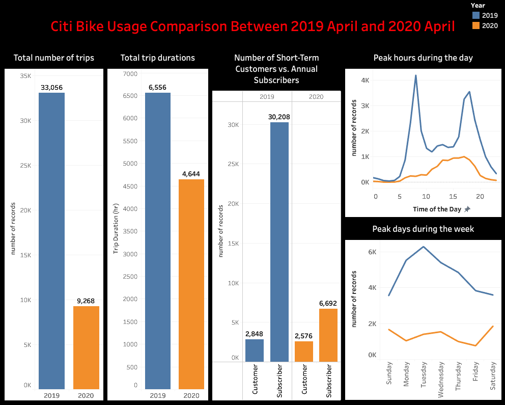

# Tableau-Homework

The dataset we are looking at is a combined (union) [Citi Bike trip history data](https://s3.amazonaws.com/tripdata/index.html) at Jersey City in the month of April, the beginning of the Spring, in 2019 and 2020. The main reason to put these two time periods together for analyses is to find out the impact of COVID-19 on outdoor activities. 

First we mapped out all the start and end stations from the dataset. As displayed in the maps, it is intereting to see that while all bike users started trips from the Jersey city, some ended their trips in Manhattan!

Next, we intened to find out the most popular bike stations with their names, locations and number of total trips recorded during the time period we concerned. Interestingly, among the top 15 start and end stations, 14 of them are identical. The stations clearly sketched out citi biker's favorable areas such as the waterfront.

Apparently, people at age 30 to 40 is the main user group among all citi bike users, by comparing the age group distributions of all users. Moreover, the number of male users is significantly larger than the number of female users among all age groups. Nevertheless, examination of the average trip durations indicated that younger female users (below age 50) tend to spend longer time riding than male users in the same age group.

Most importantly, the total number of trips as well as the total trip durations dropped dramatically in 2020 April, when compared with the data from the same month/season a year before. Not suprisingly, the number of annual subscribers also dropped remarkably. 

In addition, it is noteworthy to point out that, the two line plots revealed a clear trend of the peak bike riding days (Monday to Friday, i.e. weekdays) and hours (8AM and 6PM respectively, i.e. before and after office hours) in 2019 April. These suggested that a lot of bike users probably use citi bikes as their routine commute between work and home. However, the trend lost in 2020 April, likely due to the city lockdown and/or a switch to work from home. 

